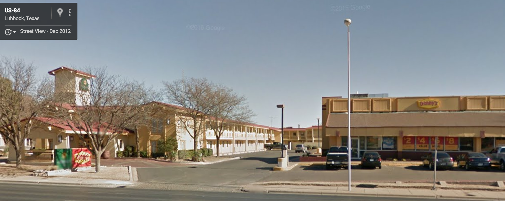

# Taking a Chance in the Classroom - La Quinta is Spanish for next to Denny's

This is building on the very interesting and fun data science project/learning tool by Colin Rundel and Mine Cetinkaya-Rundel. 

My modifications to the original repository is aimed at creating a (null) comparison for distances between Denny's and La Quinta.  
I randomly reassign positions for Denny's and La Quinta on the continental U.S., and then find the closest neighbor.  How do these distances compare with the observed distances.  

